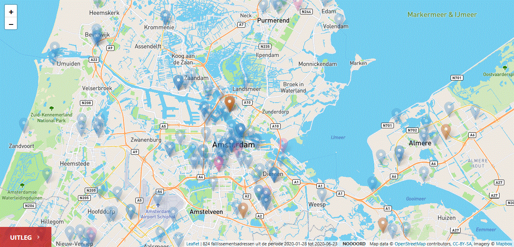

# faillissementen-scraper

maakt een kaart met faillissementen
Louter voor educatieve doeleinden - sla nooit gegevens op die een persoon kunnen identificeren.

Gebruik de escape knop als je een popup of paneel open hebt om die weer snel te sluiten.

## uitleg?

dev@sjerpbouwtsites.nl

## installeren zoals het er nu voorstaat.

[Zie de installatiegids](INSTALL.md)

## Feature ( requests )

- koppelen met omgevingsvergunnings
- bestemmingsplannen
- ná init, aparte functie, huidig gevestigde bedrijven ophalen per adres. Hoe invalideer je deze informatie?
- herschrijven in typescript
- publiceren naar microsoft azure

## ISSUES

- KvK nummers zijn uit de adressen gevallen!
- gebruik gaan maken van readdir ipv lezen uit json welke bestanden bestaan. Omzetten naar dagenDb.
- indien de start en einddata veranderen nadat dagenDb is aangemaakt, wordt dagenDb niet bijgewerkt met bv. een nieuwe reeks.
- echte database gebruiken in memory ipv in via filesystem
- opslag / database qua files rommelig
  1. overstap opslag -> database
  2. logica / instellingen verdeeld over config, nuts, etc.
- mogelijk gaat doet node een timeout. 'te doen' vanuit dagenDatabase opknippen in delen?
- benaming 'consolidatie' en 'adressen' is onduidelijk en door elkaar
- die timeout logica om door lijsten met te verwerken requests & hun ratelimiters heen te gaan is ruk
- rare discrepantie tussen hoeveelheid adressen in geo en 'adressen beschikbaar' vanuit fs?
- 'adres' voor locatieobjecten is kut want adres.adres. 'dag' voor een dagobject is ook kut.
- dagenDb moet niet een promise teruggeven. zorgt voor ellende.
